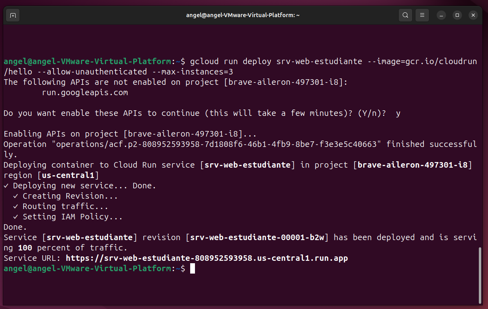

# Lab: Serverless Containers — Google Cloud Run

**Alumno:** Ángel Eduardo de Jesús Castellanos Castillo  
**Matrícula:** 19292901   
**Maestro:** Juan Miguel Hernández Ramírez  

---

## Descripción

Despliegue de un contenedor serverless de forma global utilizando Google Cloud Run desde la CLI de Google Cloud (gcloud), sin administrar sistemas operativos ni servidores físicos.

---

## Comandos utilizados

### Verificación de autenticación

```bash
gcloud auth list
```

### Configuración del proyecto GCP

```bash
gcloud config set project brave-aileron-497301-i8
```

### Paso 1 — Configurar la región operativa

```bash
gcloud config set run/region us-central1
```

### Paso 2 — Desplegar el contenedor en Cloud Run

```bash
gcloud run deploy srv-web-estudiante \
    --image=gcr.io/cloudrun/hello \
    --allow-unauthenticated \
    --max-instances=3
```

---

## Explicación de los flags

| Flag | Función |
|------|---------|
| `--allow-unauthenticated` | Hace la app pública en internet y genera certificado SSL (https://) automáticamente |
| `--max-instances=3` | Control de costos (FinOps): limita el autoescalado a 3 contenedores simultáneos |
| `--image=gcr.io/cloudrun/hello` | Imagen pública de prueba proporcionada por Google |

---

## Enlace público del servicio desplegado

🔗 **Service URL:** https://srv-web-estudiante-808952593958.us-central1.run.app

---

## Evidencia


